Die Installation unserer Software ist unkompliziert. Wählen Sie Ihr Betriebssystem für spezifische Anweisungen:



1. Laden Sie den Windows-Installer (.exe) von der [Download-Seite](/de/download) herunter.
2. Navigieren Sie zu dem Ordner, in den das EXE-Installationsprogramm heruntergeladen wurde, und klicken Sie doppelt auf dieses, um den Installationsvorgang zu starten.
3. Windows zeigt möglicherweise den folgenden Dialog an. In diesem Fall klicken Sie auf **Weitere Informationen** und fahren Sie mit der Schaltfläche **Trotzdem ausführen** fort.
   - 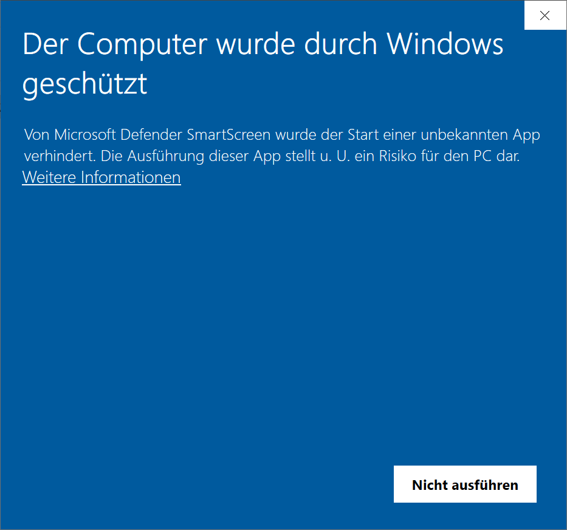
   - 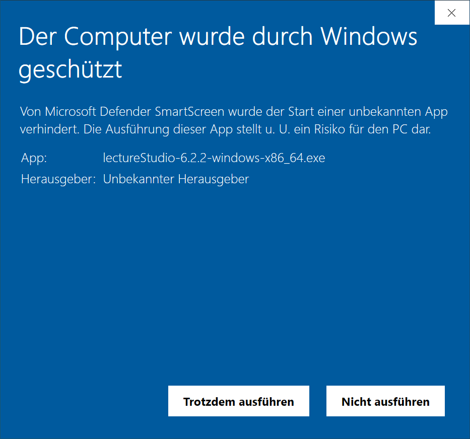
4. Nachdem das Installationsprogramm gestartet ist, akzeptieren Sie die Bedingungen in der Lizenzvereinbarung und klicken Sie auf **Installieren**. Um die Lizenzvereinbarung zu lesen, klicken Sie auf den Link **Lizenzbedingungen**.
   - 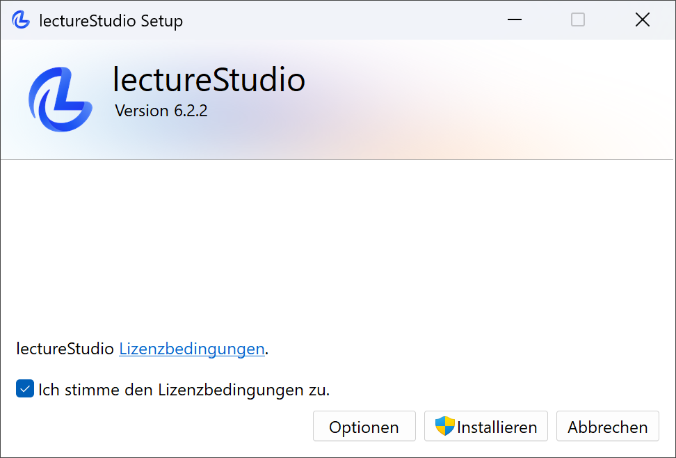
   #### Erweiterte Einrichtung
   Sie können die Installation von lectureStudio anpassen, indem Sie auf die Schaltfläche **Optionen** klicken. Jetzt können Sie auswählen, ob auf dem Desktop und im Startmenü Verknüpfungssymbole für Anwendungen erstellt werden sollen. Um den Installationsordner zu ändern, klicken Sie auf die Schaltfläche **Durchsuchen**.
   - 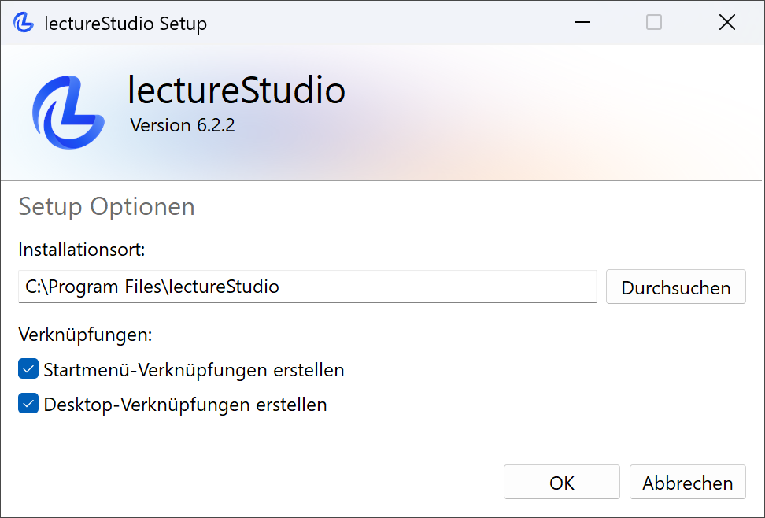
5. Windows fordert erhöhte Berechtigungen an, damit das Installationsprogramm Änderungen an ihrem Gerät vornehmen kann. Akzeptieren Sie die Anfrage.
   - 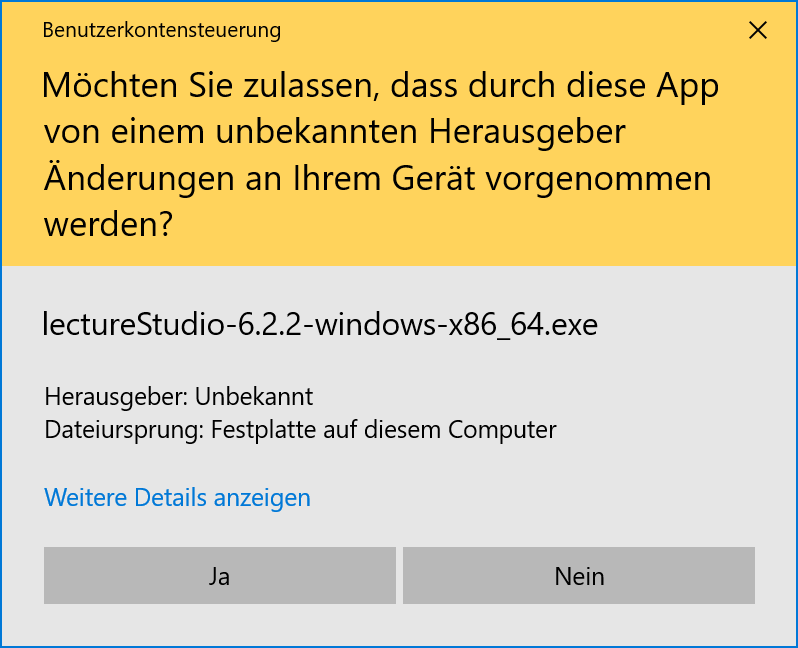
6. Klicken Sie auf die Schaltfläche **Schließen**, wenn die Installation abgeschlossen ist.
   - 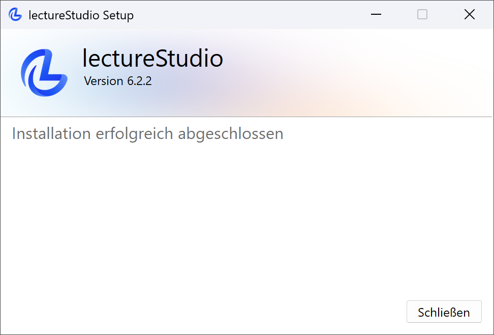
7. Nach der Installation finden Sie Verknüpfungssymbole der Anwendungen auf dem Desktop und im Startmenü, wenn Sie deren Erstellung in Schritt 4 der erweiterten Einrichtung aktiviert haben.
   - 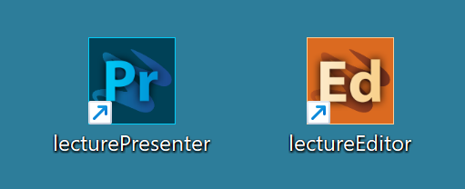
   - 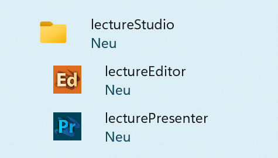



1. Laden Sie das macOS-Paket (.pkg) von der [Download-Seite](/de/download) herunter.
2. Navigieren Sie zu dem Ordner, in den das Installationspaket heruntergeladen wurde, und klicken Sie doppelt auf dieses, um den Installationsvorgang zu starten.
3. Nachdem das Installationsprogramm gestartet ist, fahren Sie nach der Einführung fort und akzeptieren die Bedingungen in der Lizenzvereinbarung. Um die Lizenzvereinbarung zu lesen, klicken Sie auf die Schaltfläche **Lizenz lesen**. Nachdem Sie die Lizenzvereinbarung akzeptiert haben, klicken Sie auf **Fortfahren**.
   - 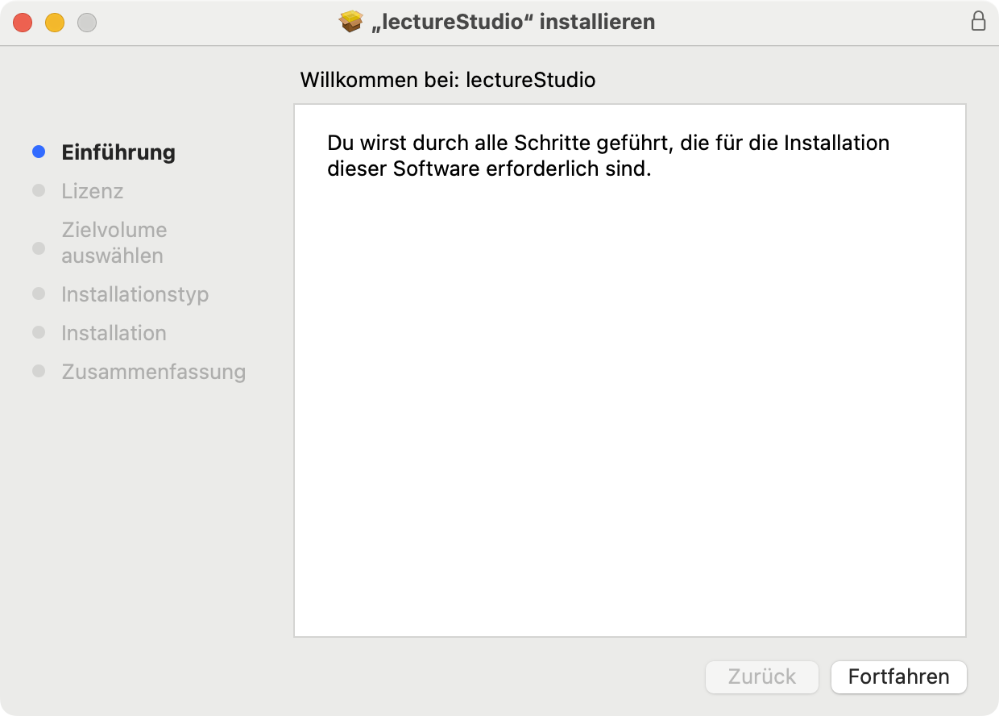
   - 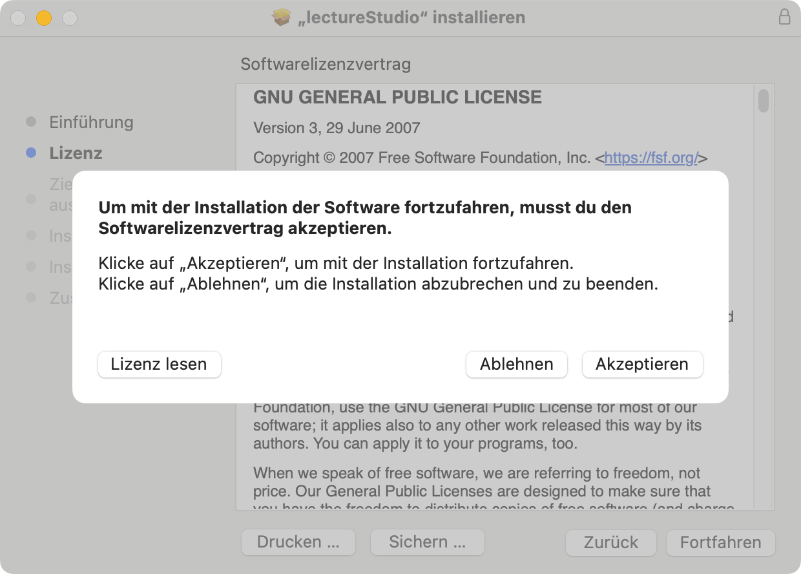
4. Nun können Sie lectureStudio auf dem Laufwerk installieren. Klicken Sie auf **Installieren**. macOS fordert erhöhte Berechtigungen an, damit das Installationsprogramm Änderungen an ihrem Gerät vornehmen kann. Geben Sie hierfür Ihren Benutzernamen und das dazugehörige Passwort ein und klicken auf **Software installieren**.
   - 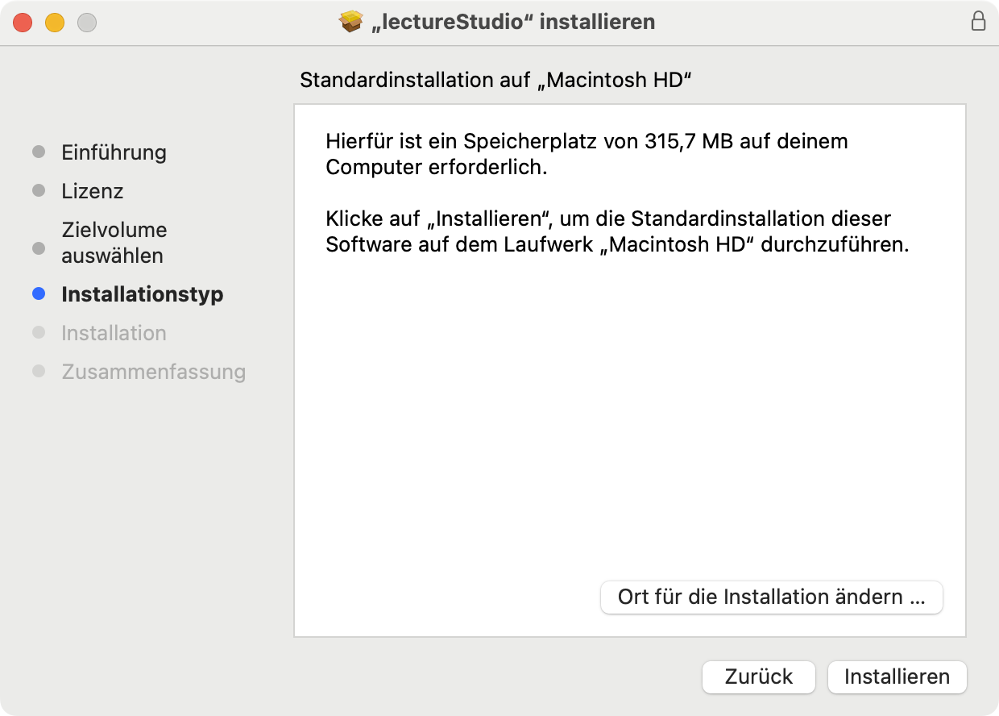
   - 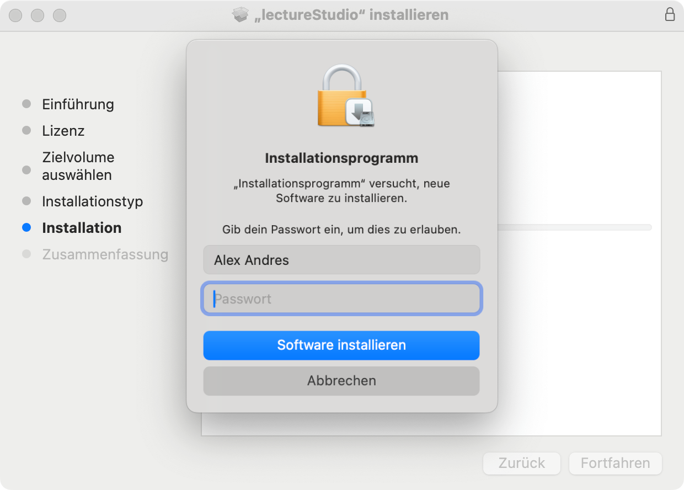
5. Sobald die Installation erfolgreich abgeschlossen ist, klicken Sie auf die Schaltfläche **Schließen**.
   - 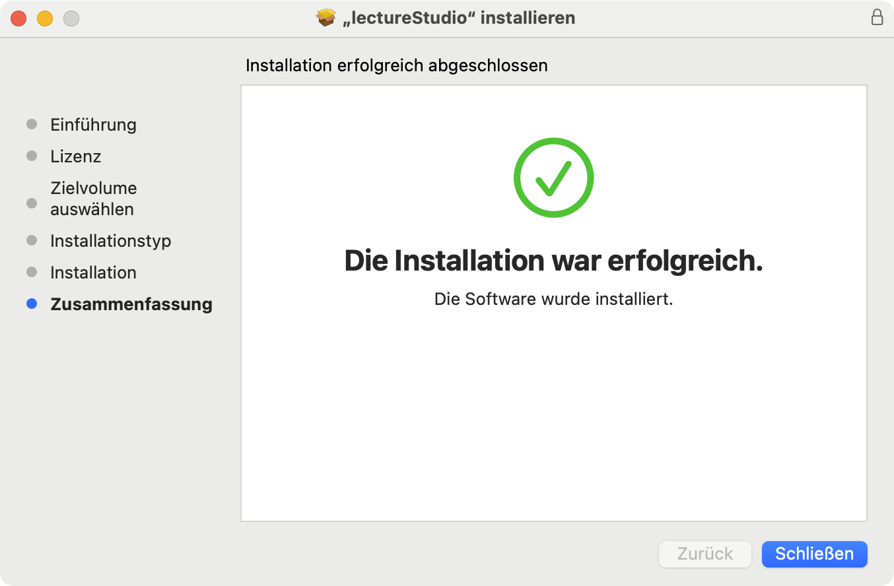
6. Nach der Installation finden Sie Verknüpfungssymbole der Anwendungen im Launchpad.
   - 



1. Laden Sie das passende Paket für Ihre Distribution von der [Download-Seite](/de/download) herunter.
2. Navigieren Sie zu dem Ordner, in den das Paket heruntergeladen wurde.
3. Für Debian/Ubuntu:
   ```bash
   sudo dpkg -i lecturestudio_*-linux_amd64.deb
   ```
   Falls dpkg die .deb-Datei installiert, aber anzeigt, dass erforderliche Pakete fehlen, führen Sie den folgenden Befehl aus, um fehlende Abhängigkeiten zu beheben:
   ```bash
   sudo apt-get install -f
   ```
4. Für Fedora/RHEL:
   ```bash
   sudo rpm -i lecturestudio-*-linux.x86_64.rpm 
   ```
5. ZIP-Archiv installieren:
   1. Entpacken Sie das Archiv über die Kommandozeile oder über das Kontextmenü der grafischen Bedienoberfläche.
      In der Kommandozeile entpacken:
      ```bash
      unzip lectureStudio-*-linux-x86_64.zip 
      ```
   2. Kopieren Sie das entpackte lectureStudio-Verzeichnis an sein endgültiges Ziel.
   3. Die Anwendungen sind im Verzeichnis **bin** des lectureStudio Verzeichnisses zu finden.
6. Starten Sie die Anwendungen über Ihr Anwendungsmenü oder Terminal mit **lecturePresenter** oder **lectureEditor**.

