Installing our software is straightforward. Select your operating system below for specific instructions:



1. Download the Windows installer (.exe) from the [download page](/en/download).
2. Navigate to the folder in which the EXE installer was downloaded and double-click on it to start the installation process.
3. Windows may display the following dialog. In this case, click on **More information** and continue with the **Run anyway** button.
   - 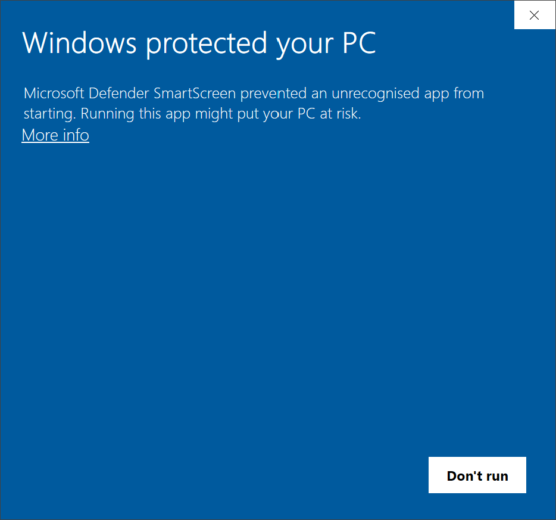
   - 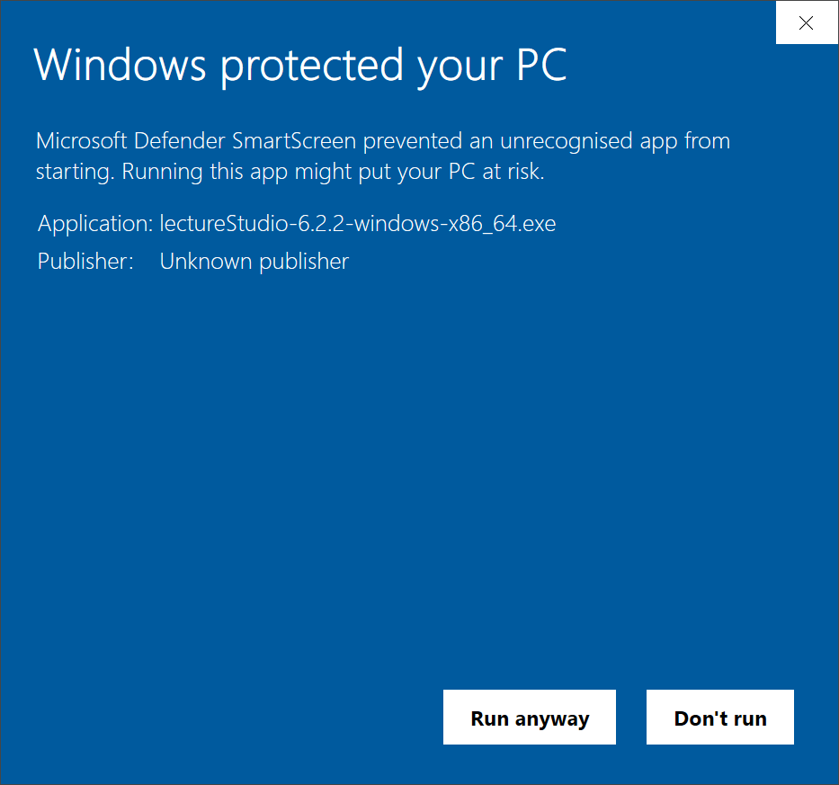
4. Once the installer has started, accept the terms in the licence agreement and click on **Install**. To read the licence agreement, click on the **license terms** link.
   - 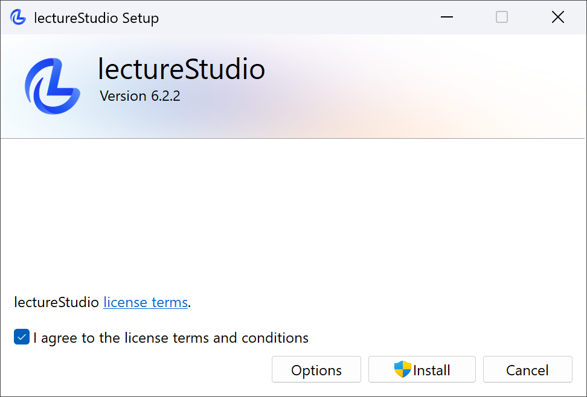
   #### Extended Setup
   You can customize the installation of lectureStudio by clicking on the **Options** button. Now you can choose whether to create shortcut icons for applications on the desktop and in the start menu. To change the installation folder, click on the **Browse** button.
   - 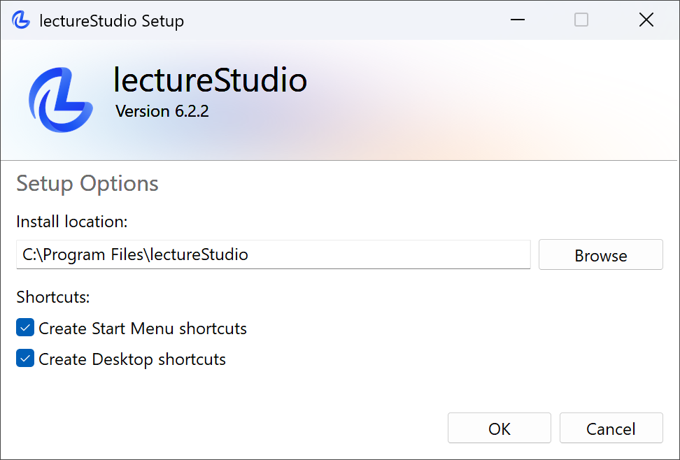
5. Windows will ask for elevated permissions to allow the installer to make changes to your device. Accept the request.
   - 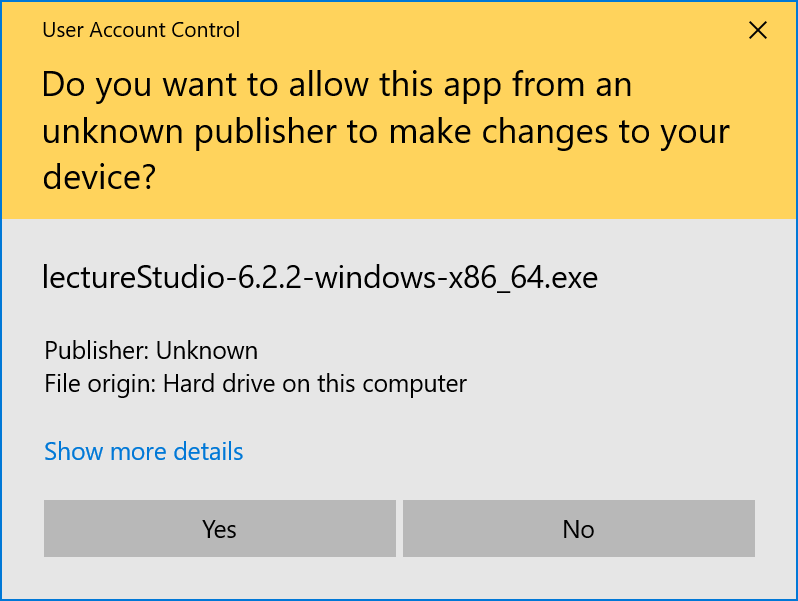
6. Click on the **Close** button when the installation is complete.
   - 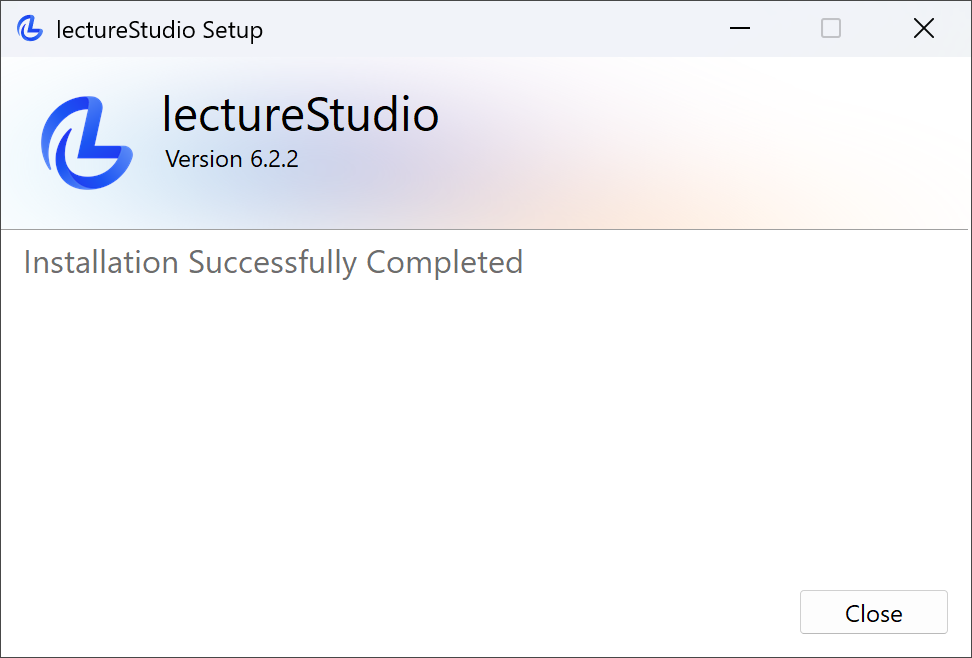
7. After installation, you will find shortcut icons for the applications on the desktop and in the start menu if you have activated their creation in step 4 of the advanced setup.
   - 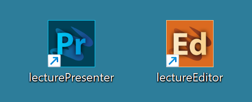
   - 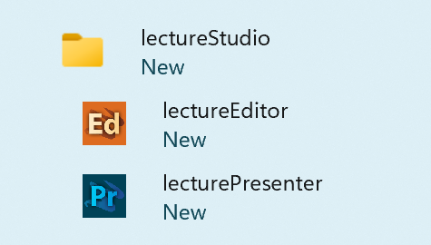



1. Download the macOS package (.pkg) from the [download page](/en/download).
2. Navigate to the folder in which the installation package was downloaded and double-click on it to start the installation process.
3. Once the installation has started, continue after the introduction and accept the conditions in the licence agreement. To read the licence agreement, click on the **Read licence** button. Once you have accepted the licence agreement, click **Continue**.
   - 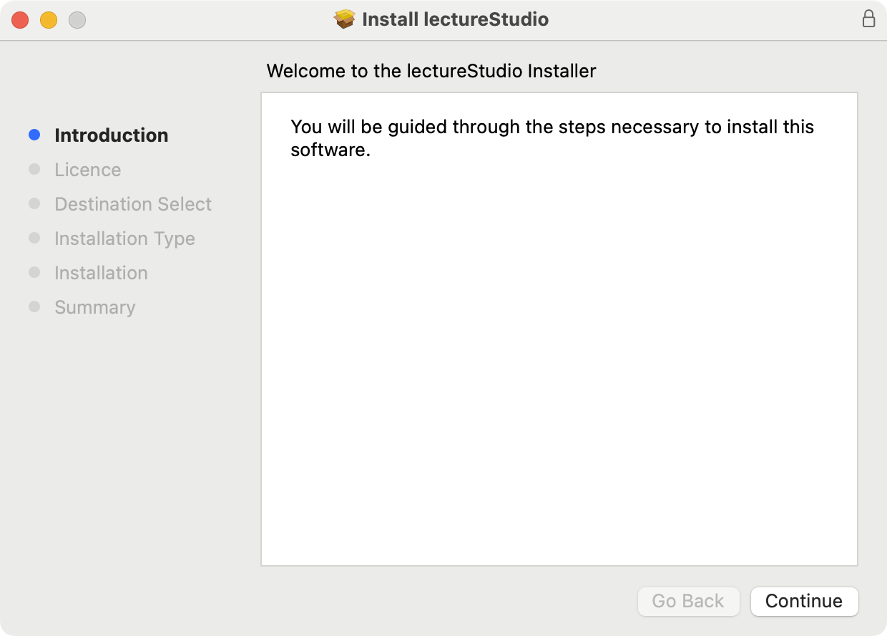
   - 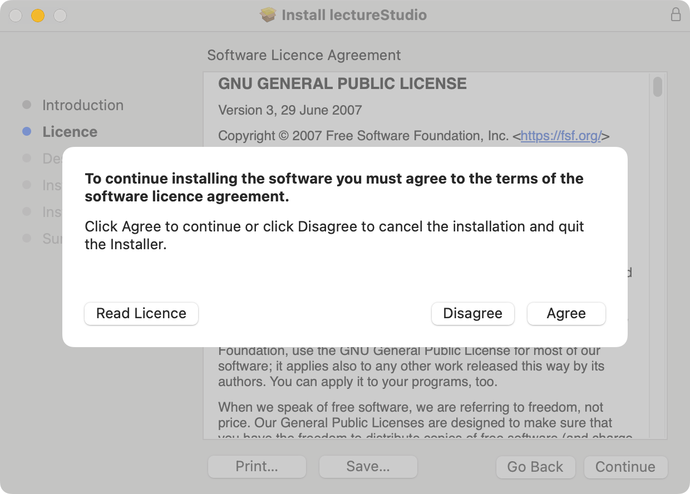
4. You can now install lectureStudio on the drive. Click on **Install**. macOS requests elevated authorisations so that the installation can make changes to your device. To do this, enter your user name and password and click on **Install Software**.
   - 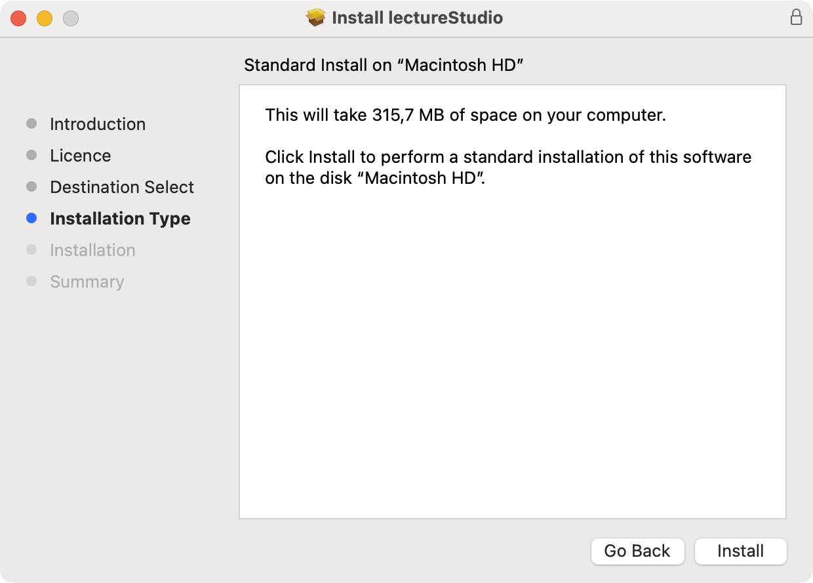
   - 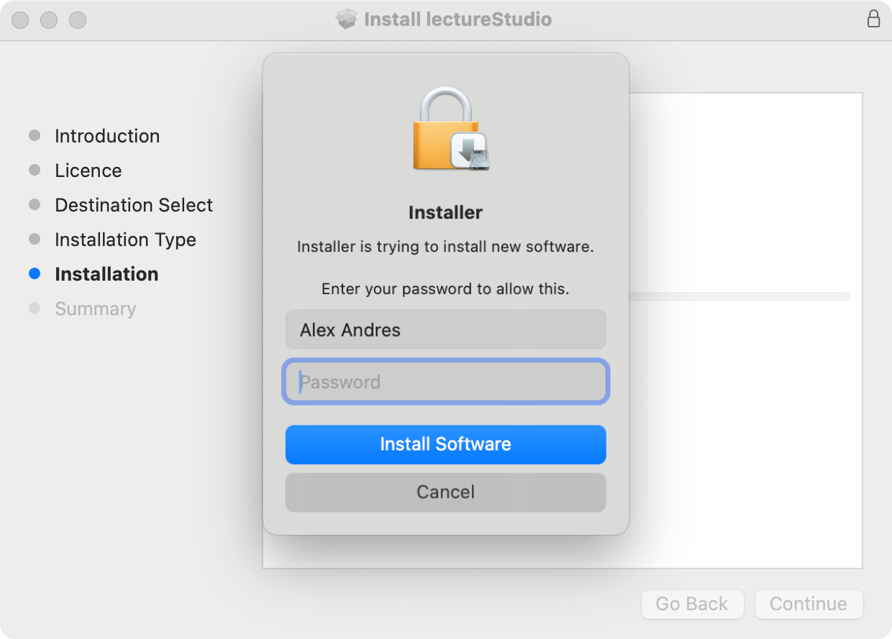
5. Once the installation has been successfully completed, click on the **Close** button.
   - 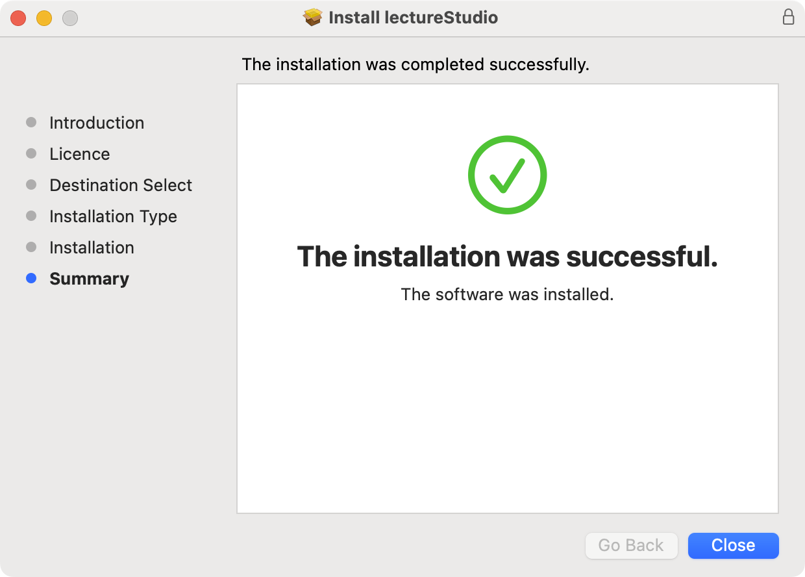
6. After installation, you will find shortcut icons for the applications in the Launchpad.
   - 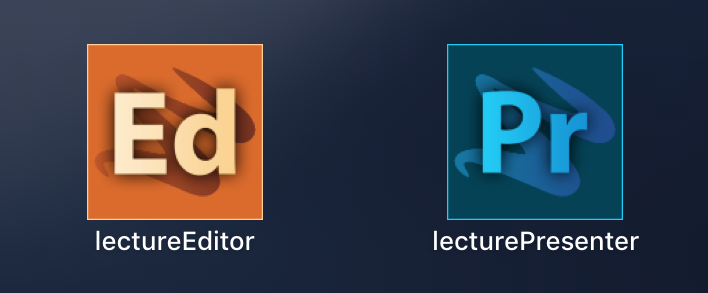



1. Download the appropriate package for your distribution from the [download page](/en/download).
2. Navigate to the folder in which the package was downloaded.
3. For Debian/Ubuntu:
   ```bash
   sudo dpkg -i lecturestudio_*-linux_amd64.deb
   ```
   In case dpkg installs the .deb file but says that required packages are missing, run the following command to fix missing dependencies:
   ```bash
   sudo apt-get install -f
   ```
4. For Fedora/RHEL:
   ```bash
   sudo rpm -i lecturestudio-*-linux.x86_64.rpm 
   ```
5. Install ZIP archive:
   1. Unpack the archive via the command line or via the context menu of the graphical user interface.
      Unpack in the command line:
      ```bash
      unzip lectureStudio-*-linux-x86_64.zip 
      ```
   2. Copy the unpacked lectureStudio directory to its final destination.
   3. The applications can be found in the **bin** directory of the lectureStudio directory.
6. Launch the applications from your applications menu or terminal with **lecturePresenter** or **lectureEditor**.


