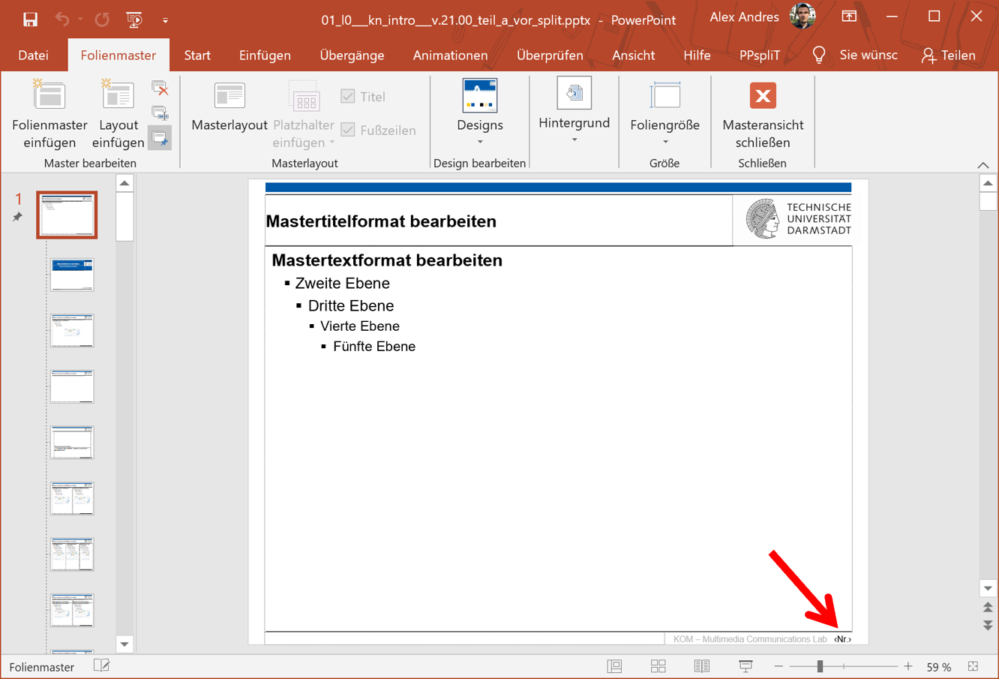
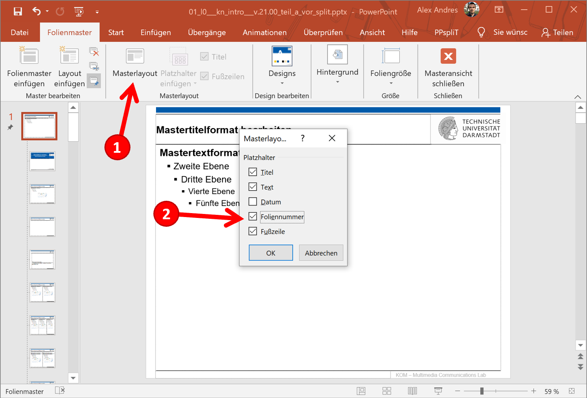
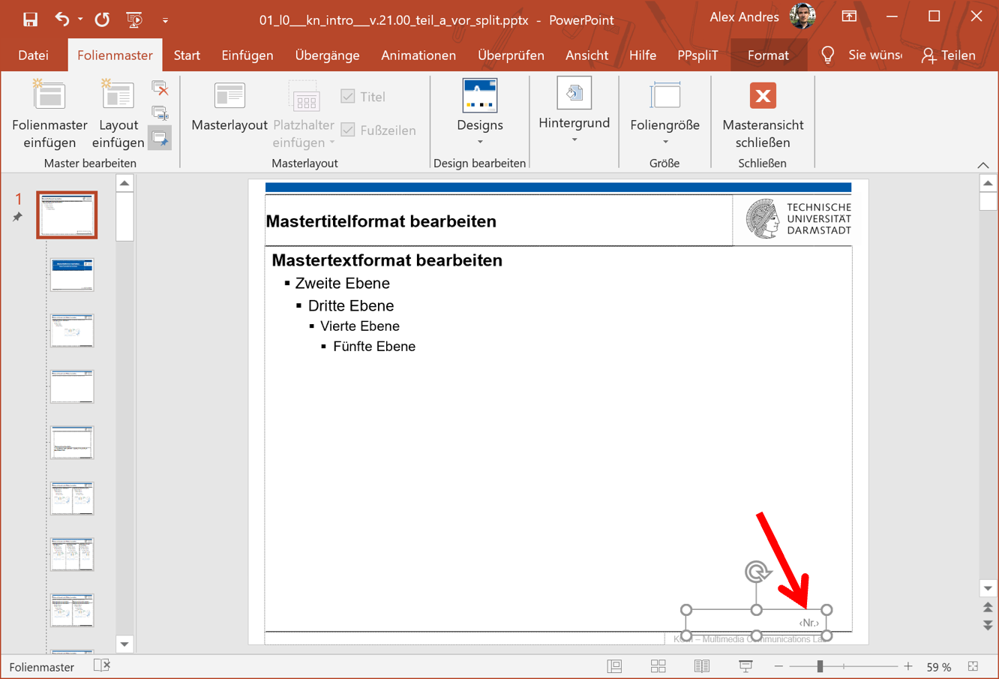
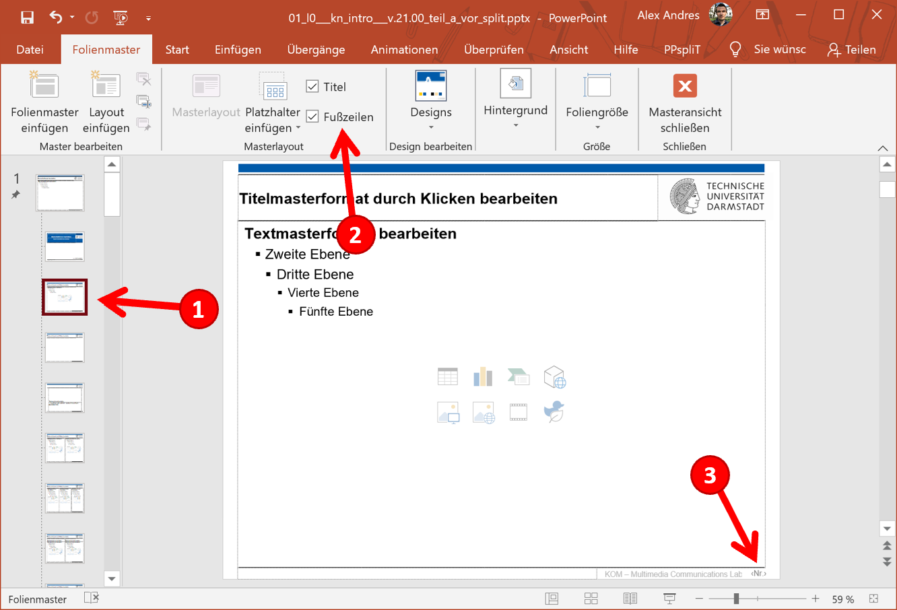
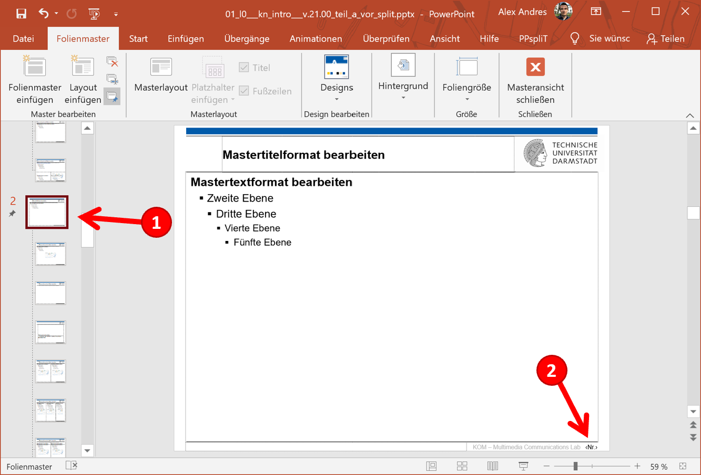
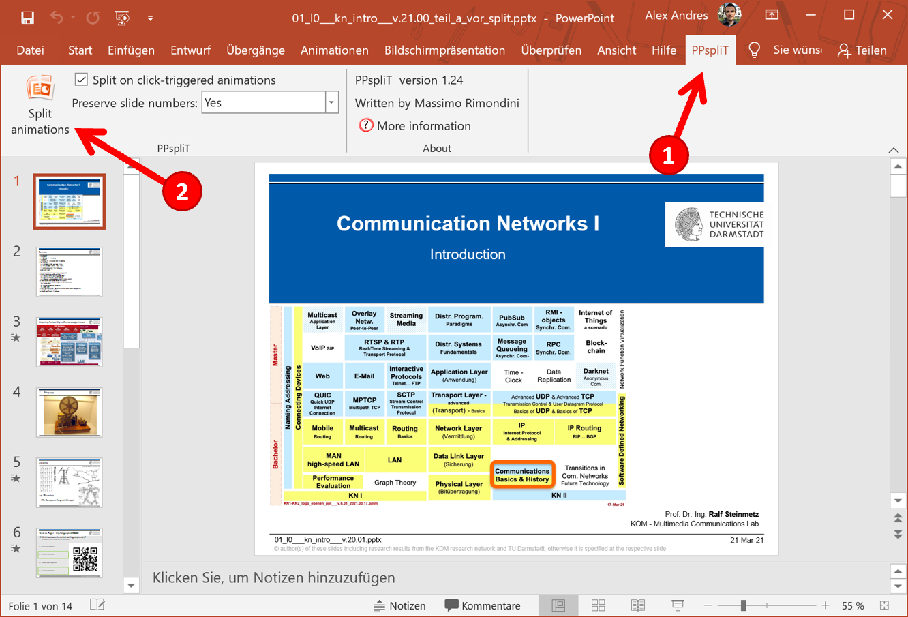

Beim Aufteilen von PowerPoint-Animationen in mehrere Folien behält PPspliT nicht immer die Foliennummern bei. Falls die Foliennummer zu einer Animation fortgezählt wird, Sie aber die gleiche Nummer haben möchten, dann finden Sie im Folgenden Anweisungen, wie Sie dieses Problem beheben können. Das Tool PPspliT verfügt über wissentlich nicht unterstützte Funktionen zur Beibehaltung von Foliennummern, wenn:
- Sie mit einer PPTX-Datei arbeiten, die mit dem Microsoft Office Compatibility Pack in PowerPoint <= 2003 importiert wird.
- Sie Foliennummern in Standardtextfeldern haben, die nicht im Folienmaster definiert und in Kopf- oder Fußzeilen eingefügt wurden.

Wenn Sie Ihre Folien mit neueren Versionen von PowerPoint erstellt haben, dann können Sie diesen Teil überspringen.

1. In den Folienmaster wechseln.
2. Textfeld für Foliennummer entfernen.
   - 
3. Foliennummer dem Masterlayout hinzufügen.
   - 
4. Neues Textfeld für Foliennummer positionieren und formatieren.
   - 
5. Foliennummer für Layouts übernehmen:
   1. Layout-Folie auswählen (1).
   2. Fußzeilen-Checkbox anklicken (auch, wenn schon aktiviert ist) (2).
   3. Foliennummer wird dem Layout hinzugefügt (3).
   4. Schritte 5.1 – 5.2 für restliche Layouts unten wiederholen.
   - 
6. Für weitere Master-Layouts (1):
   1. Textfeld für Foliennummer entfernen (2).
   2. Textfeld für Foliennummer aus vorherigem Layout kopieren und einfügen (kopieren–einfügen: wird automatisch an dieselbe Position gesetzt).
   3. Schritte 5.1 – 5.2 für restliche Layouts unten wiederholen.
   - 
7. Masteransicht schließen und PPspliT ausführen.
   - 