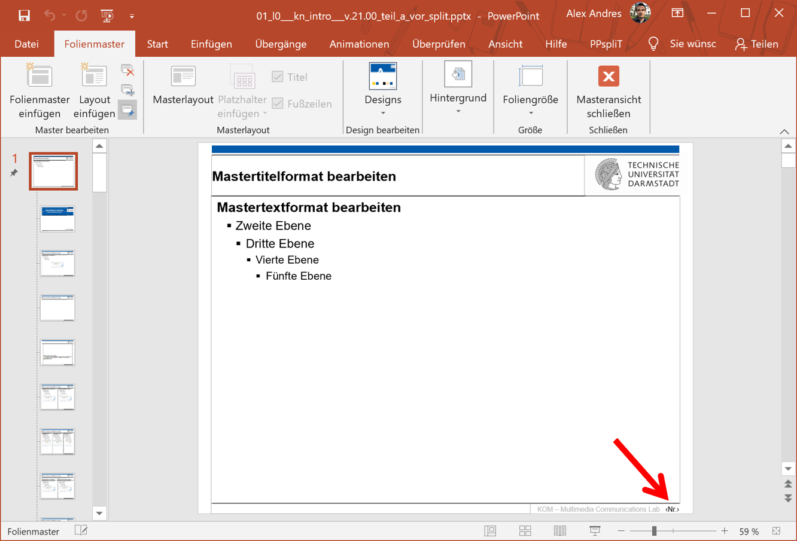
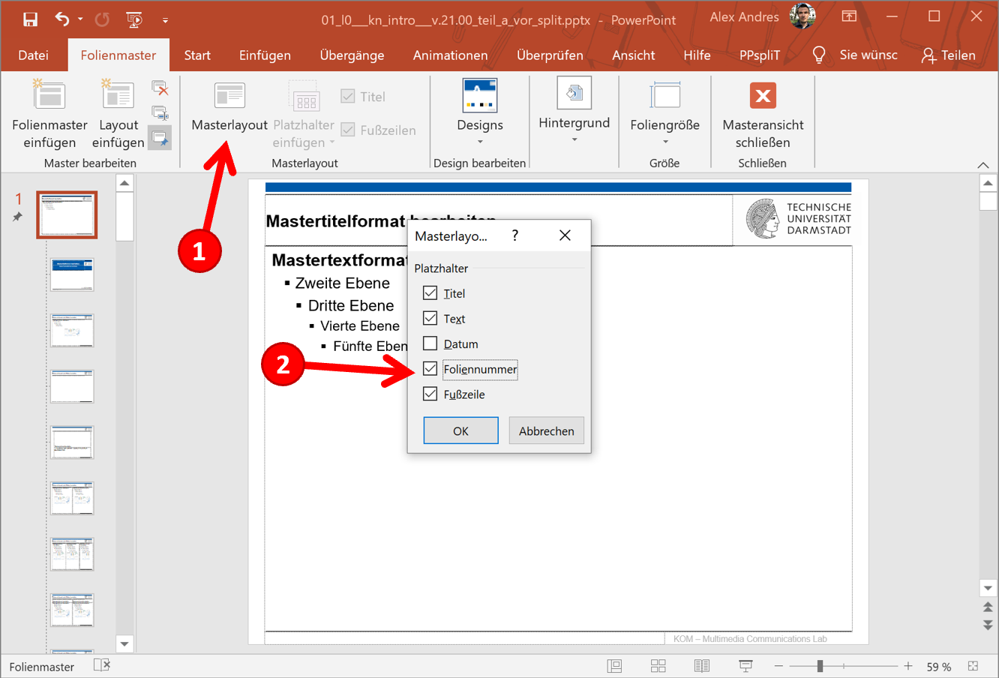
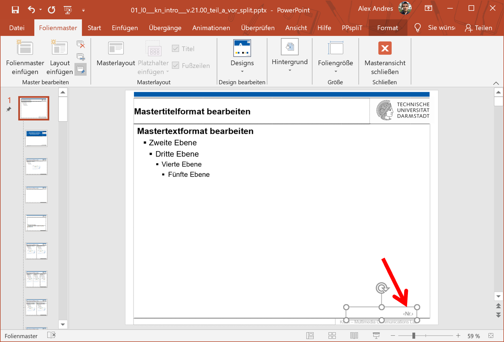
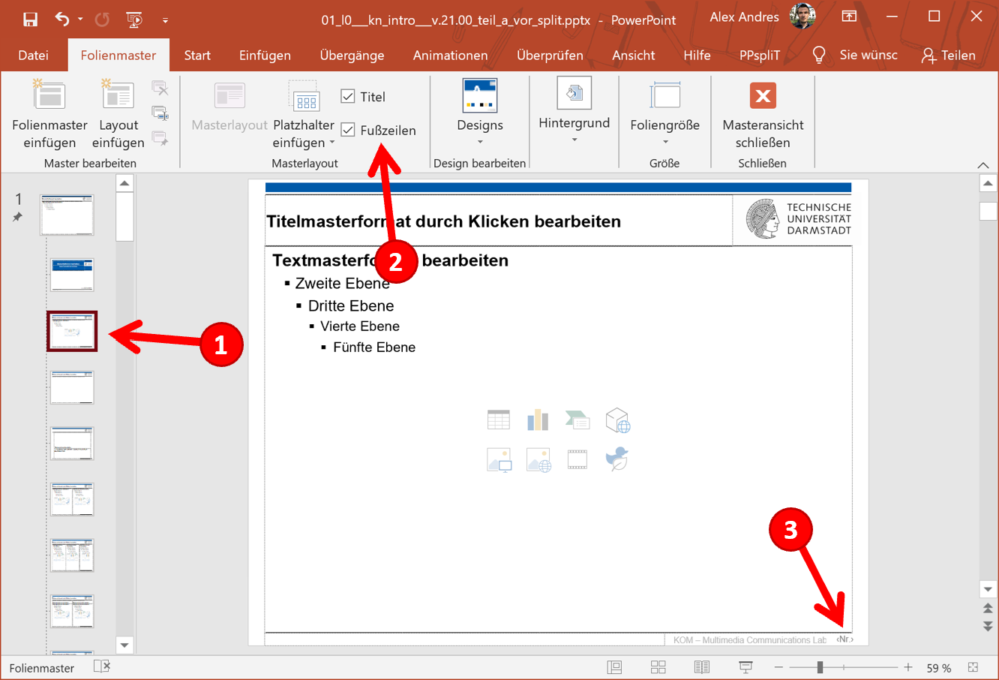
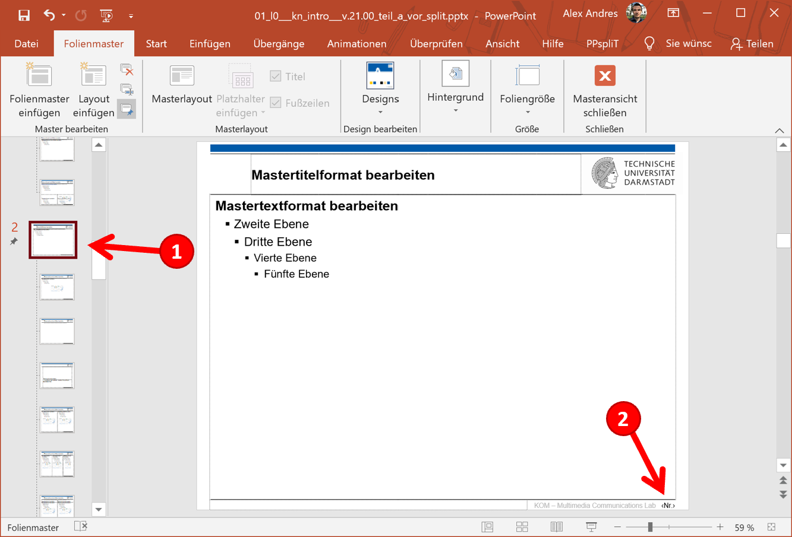
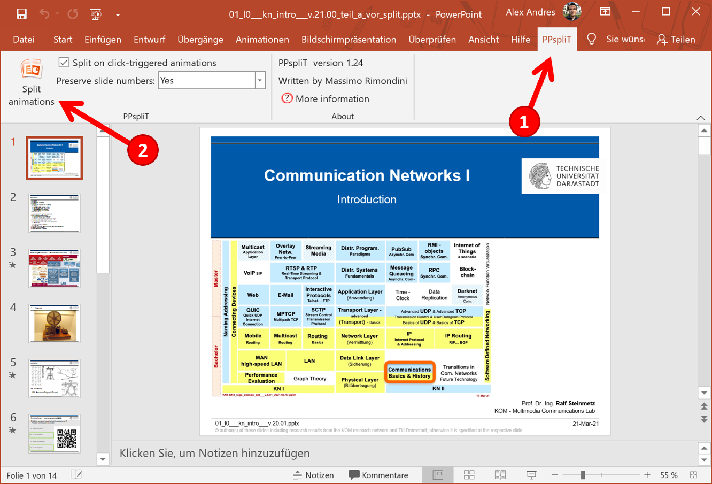

In case you are splitting animations into multiple slides with PPspliT and have issues with preserving slide numbers, the instructions below describe how to solve that issue. The tool PPspliT has knowingly unsupported features regarding the preservation of slide numbers, if:
- you are operating on a PPTX file that is imported into PowerPoint <=2003 using the Microsoft Office Compatibility Pack.
- you have slide numbers that appear in standard text boxes that were not defined in slide masters and inserted as headers/footers in the slide deck.

If you created your slides with newer versions of PowerPoint, then you can skip this part.

1. Switch to the slide master.
2. Remove text field for slide number.
   - 
3. Add the slide number to the master layout.
   - 
4. Position and format the new text field for the dynamic slide number.
   - 
5. Apply the slide number to layouts:
   1. Select a layout slide (1).
   2. Click the Footers checkbox (even if it is already activated) (2).
   3. The slide number is added to the layout (3).
   4. Repeat steps 5.1 - 5.2 for the remaining layouts below.
   - 
6. For multiple master layouts (1):
   1. Remove the text field for the dynamic slide number (2).
   2. Copy and paste the slide number text field from the previous layout (copy–paste: is automatically placed in the same position).
   3. Repeat steps 5.1 - 5.2 for the remaining layouts below.
   - 
7. Close the master view and execute PPspliT.
   - 