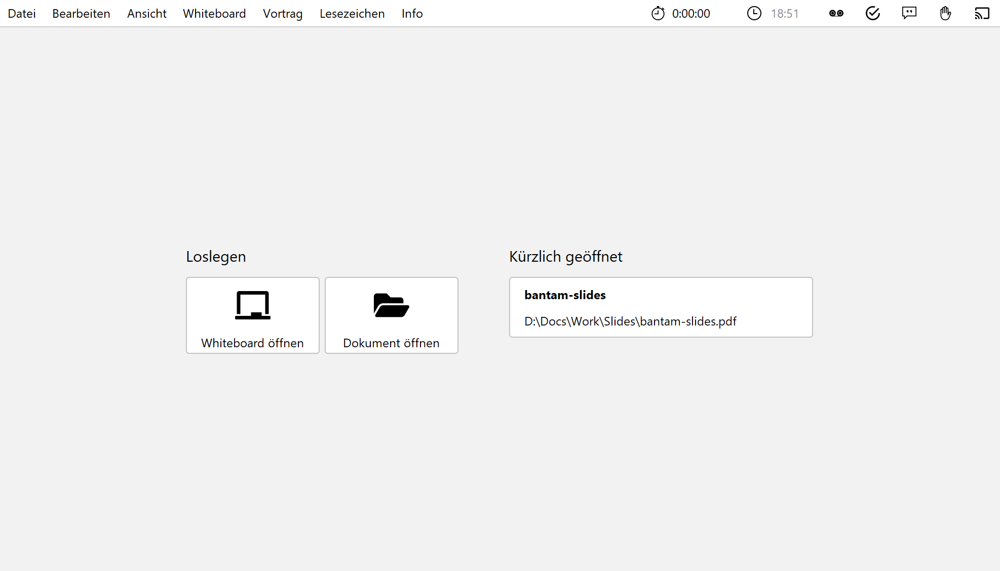
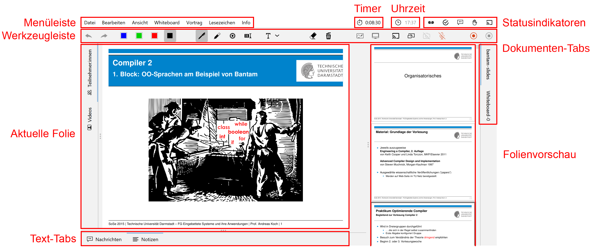

Starten Sie lecturePresenter über das Startmenü oder den Desktop Shortcut. Sie werden dann mit dem Startbildschirm begrüßt. Hier können Sie entweder eine der zuletzt geöffneten Dateien laden, ein leeres **Whiteboard öffnen**, oder über den Button **Dokument öffnen** eine neue Datei auswählen.

Sobald Sie ein PDF-Dokument oder ein Whiteboard geöffnet haben, finden Sie die Benutzeroberfläche wie in der folgenden Abbildung dargestellt wieder.
