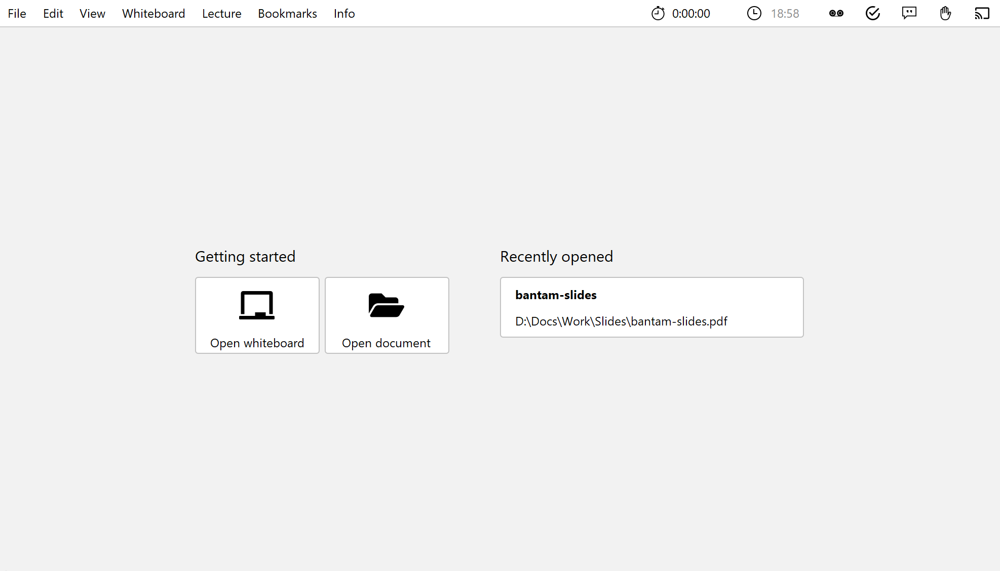
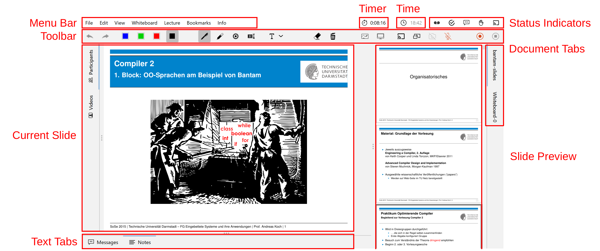

Start lecturePresenter via the start menu or the desktop shortcut. You will then be greeted with the start screen. Here you can either load one of the recently opened files, open an empty **Whiteboard**, or select a new file using the **Open document** button.

As soon as you have opened a PDF document or a whiteboard, you will find the user interface as shown in the following image.
