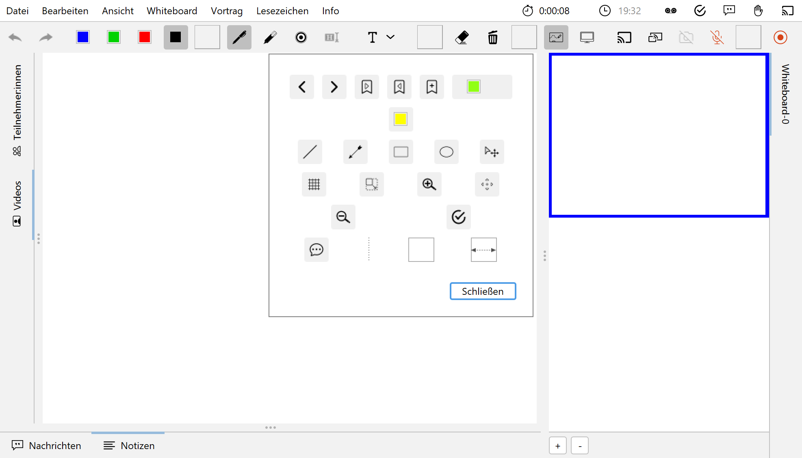

Die Werkzeugleiste lässt sich Ihren Bedürfnissen nach anpassen. So können Sie zum Beispiel nur die Werkzeuge in der Leiste anzeigen lassen, die Sie tatsächlich brauchen und nutzen. Für eine bessere Übersicht und Struktur können drei verschiedene Abstandshalter zwischen den Werkzeug-Buttons eingefügt werden: Ein vertikaler und schmaler Abstandshalter, ein etwas breiter Abstandshalter mit fester Breite und ein dynamischer Abstandshalter, der den leeren Raum in der Leiste einnimmt und so die Buttons in die Ecken der Werkzeugleiste verschiebt.

Die Benutzeroberfläche zur Anpassung der Werkzeugleiste ist in folgender Abbildung zu sehen. Die einzelnen Buttons können aus dem Dialog in die Werkzeugleiste gezogen und an die gewünschte Position hinzugefügt werden. Um die Buttons aus der Werkzeugleiste zu entfernen, ziehen Sie den jeweiligen Button aus der Werkzeugleiste heraus und legen diesen irgendwo im Fenster ab.
