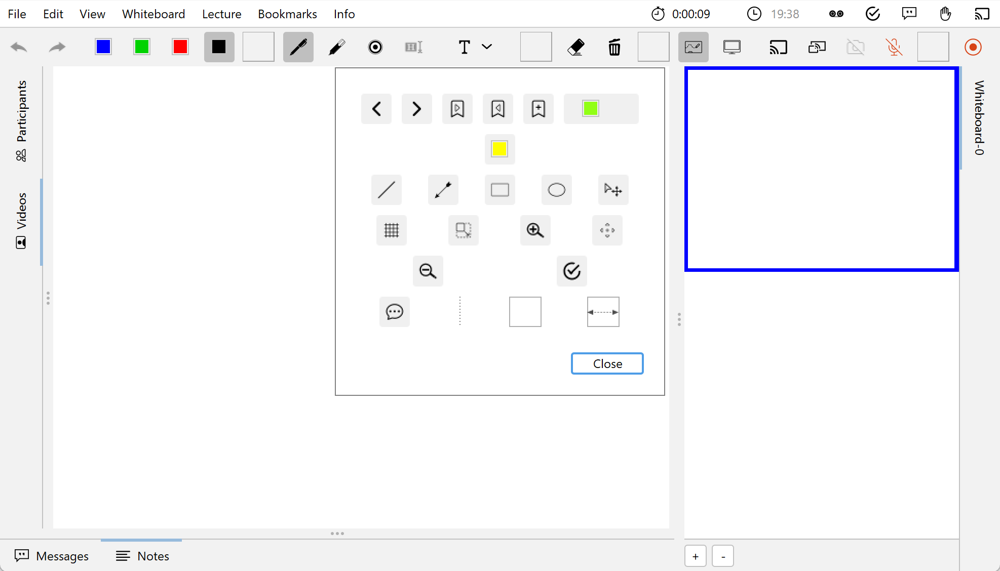

The toolbar can be customised to suit your needs. For example, you can display only those tools in the toolbar that you actually need and use. For a better overview and structure, three different spacers can be inserted between the tool buttons: A vertical and narrow spacer, a slightly wider spacer with a fixed width and a dynamic spacer that takes up the empty space in the bar and thus moves the buttons to the corners of the toolbar.

The user interface for customising the toolbar is shown in the following image. The individual buttons can be dragged from the dialogue into the toolbar and added to the desired position. To remove the buttons from the toolbar, drag the respective button out of the toolbar and drop it somewhere in the window.
