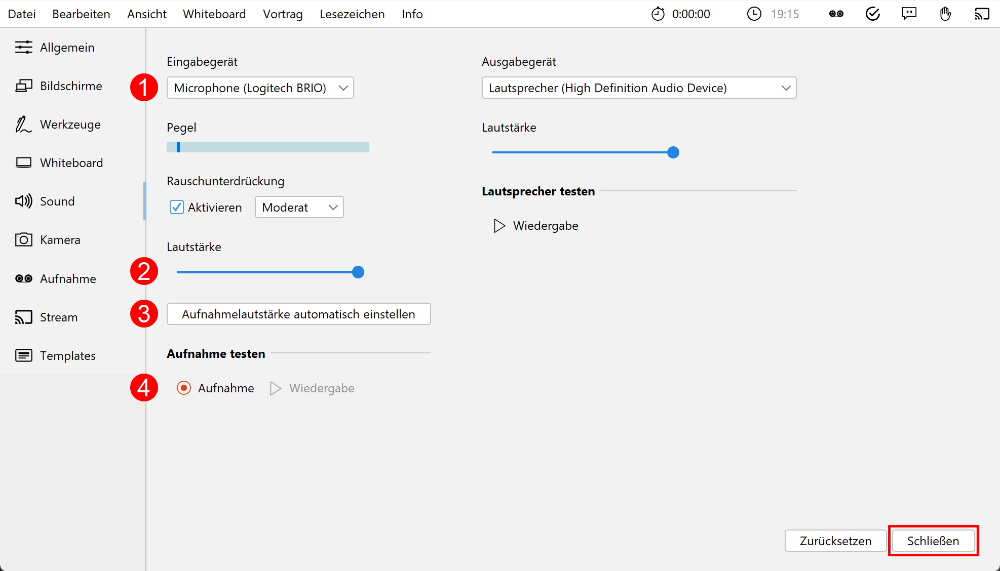

Schließen Sie das zu verwendende Mikrofon an den Rechner an. Sie können ein externes Headset benutzen, oder – sofern vorhanden – die Hörsaal-Audio-Anlage mit dem Laptop verbinden. Viele Laptops besitzen auch ein eingebautes Mikrofon, es wird jedoch von seiner Verwendung abgeraten, da die Audioqualität für gewöhnlich zu wünschen übrig lässt – besonders, wenn sich der Vortragende vom Rechner entfernt.

Richten Sie nun das gewünschte Mikrofon ein:
1. Öffnen Sie die Einstellungen über das Menü *Bearbeiten > Einstellungen*.
2. Navigieren Sie zum Tab **Mikrofon**.
3. Wählen Sie das korrekte Mikrofon aus (1).
4. Mit dem Regler (2) können Sie die Lautstärke des Mikrofons anpassen.
5. Alternativ können Sie die Aufnahmelautstärke anpassen, indem Sie den Aufnahmepegel automatisch einstellen lassen (3).
   Klicken Sie im Dialog auf **Beginnen** und sprechen Sie eine Zeit lang in das ausgewählte Mikrofon. Nachdem Sie auf **Fertig** geklickt haben, wird die Mikrofonlautstärke auf den maximal erreichten Pegel eingestellt.
6. Machen Sie eine kurze Aufzeichnung (4) und überprüfen diese auf Rauschen, Nebengeräusche, Hall, usw.
7. Abschließend klicken Sie auf den Button **Schließen**, um die Einstellungen zu speichern.

