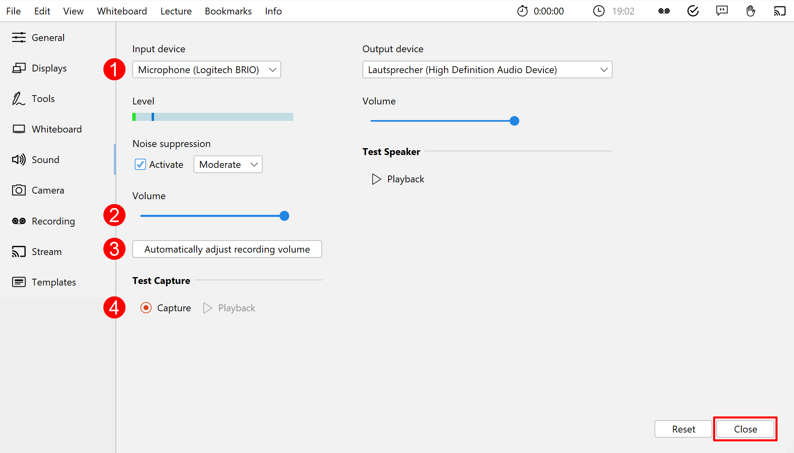

Connect the microphone to be used to the computer. You can use an external headset or - if available - connect the lecture hall audio system to the laptop. Many laptops also have a built-in microphone, but its use is not recommended as the audio quality is usually poor - especially if the lecturer is away from the computer.

Now set up the desired microphone:
1. Open the settings via the menu *Edit > Settings*.
2. Navigate to the **Microphone** tab.
3. Select the appropriate microphone (1).
4. You can use the slider (2) to adjust the volume of the microphone.
5. Alternatively, you can adjust the recording volume by setting the recording level automatically (3).
   Click **Start** in the dialogue and speak into the selected microphone for a while. After you have clicked **Done**, the microphone volume is set to the maximum level reached.
6. Make a short recording (4) and check it for noise, background noises, reverberation, etc.
7. Finally, click on the **Close** button to save the settings.

